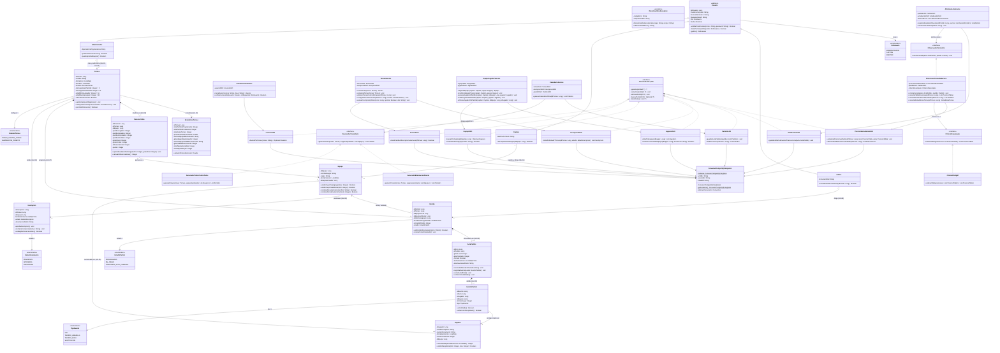

```mermaid
classDiagram
    direction TB

    %% ==========================================
    %% 1. ENUMERACIONES Y EXCEPCIONES DEL DOMINIO
    %% ==========================================
    class RolUsuario {
        <<enumeration>>
        ADMINISTRADOR
        CAPITAN
        ARBITRO
    }

    class FormatoTorneo {
        <<enumeration>>
        TODOS_CONTRA_TODOS
        ELIMINACION_DIRECTA
    }

    class EstadoInscripcion {
        <<enumeration>>
        PENDIENTE
        APROBADA
        RECHAZADA
    }

    class EstadoPartido {
        <<enumeration>>
        PROGRAMADO
        EN_JUEGO
        FINALIZADO_ACTA_CERRADA
    }

    class TipoEvento {
        <<enumeration>>
        GOL
        TARJETA_AMARILLA
        TARJETA_ROJA
        SUSTITUCION
    }

    class DatosInvalidosException {
        <<exception>>
        -codigoError: String
        -campoAfectado: String
        +DatosInvalidosException(mensaje: String, campo: String)
        +obtenerDetalleError() String
    }

    %% ==========================================
    %% 2. JERARQUÍA DE USUARIOS (HU-01)
    %% ==========================================
    class Usuario {
        <<abstract>>
        #idUsuario: Long
        #nombreCompleto: String
        #correoElectronico: String
        #passwordHash: String
        #rol: RolUsuario
        #activo: Boolean
        +validarCredenciales(correo: String, password: String) Boolean
        +tienePermiso(rolRequerido: RolUsuario) Boolean
        +getRol() RolUsuario
    }

    class Administrador {
        -dependenciaOrganizadora: String
        +puedeGestionarTorneos() Boolean
        +puedeAprobarEquipos() Boolean
    }

    class Capitan {
        -telefonoContacto: String
        +esPropietarioDeEquipo(idEquipo: Long) Boolean
    }

    class Arbitro {
        -licenciaArbitral: String
        +estaHabilitadoParaPartido(idPartido: Long) Boolean
    }

    Usuario <|-- Administrador
    Usuario <|-- Capitan
    Usuario <|-- Arbitro
    Usuario --> RolUsuario : tiene >

    %% ==========================================
    %% 3. ENTIDADES NUCLEARES (HU-02 a HU-10)
    %% ==========================================
    class Torneo {
        -idTorneo: Long
        -nombre: String
        -fechaInicio: LocalDate
        -fechaFin: LocalDate
        -formato: FormatoTorneo
        -minJugadoresPlantilla: Integer = 5
        -maxJugadoresPlantilla: Integer = 15
        -edadMinimaJugador: Integer = 16
        -edadMaximaJugador: Integer = 45
        -calendarioGenerado: Boolean
        +validarCamposObligatorios() void
        +configurarFormato(nuevoFormato: FormatoTorneo) void
        +permiteEliminacion() Boolean
    }

    class Equipo {
        -idEquipo: Long
        -nombreEquipo: String
        -siglas: String
        -fechaCreacion: LocalDate
        -idCapitanCreador: Long
        +validarCupoParaAgregar(max: Integer) Boolean
        +validarCupoParaEliminar(min: Integer) Boolean
        +contieneDocumento(numeroDoc: String) Boolean
        +contieneDorsal(numeroCamiseta: Integer) Boolean
    }

    class Jugador {
        -idJugador: Long
        -nombreCompleto: String
        -numeroDocumento: String
        -fechaNacimiento: LocalDate
        -numeroCamiseta: Integer
        -idEquipo: Long
        +calcularEdad(fechaReferencia: LocalDate) Integer
        +validarRangoEdad(min: Integer, max: Integer) Boolean
    }

    class Inscripcion {
        -idInscripcion: Long
        -idTorneo: Long
        -idEquipo: Long
        -fechaSolicitud: LocalDateTime
        -estado: EstadoInscripcion
        -observacionAdmin: String
        +aprobarInscripcion() void
        +rechazarInscripcion(motivo: String) void
        +esElegibleParaCalendario() Boolean
    }

    class Partido {
        -idPartido: Long
        -idTorneo: Long
        -idEquipoLocal: Long
        -idEquipoVisitante: Long
        -idArbitroAsignado: Long
        -fechaHoraProgramada: LocalDateTime
        -jornadaORonda: Integer
        -estado: EstadoPartido
        +esMismoEnfrentamiento(otro: Partido) Boolean
        +marcarComoFinalizado() void
    }

    class ActaPartido {
        -idActa: Long
        -idPartido: Long
        -golesLocal: Integer
        -golesVisitante: Integer
        -cerrada: Boolean
        -fechaHoraCierre: LocalDateTime
        -observacionesArbitro: String
        +recalcularMarcadorDesdeEventos() void
        +registrarEvento(evento: EventoPartido) void
        +cerrarActaOficial() void
        +verificarInmutabilidad() void
    }

    class EventoPartido {
        -idEvento: Long
        -idActa: Long
        -idJugador: Long
        -idEquipo: Long
        -minutoJuego: Integer
        -tipo: TipoEvento
        +esGolValido() Boolean
        +esSancionDisciplinaria() Boolean
    }

    class PosicionTabla {
        -idPosicion: Long
        -idTorneo: Long
        -idEquipo: Long
        -partidosJugados: Integer
        -partidosGanados: Integer
        -partidosEmpatados: Integer
        -partidosPerdidos: Integer
        -golesFavor: Integer
        -golesContra: Integer
        -diferenciaGoles: Integer
        -puntos: Integer
        +aplicarResultadoPartido(golesPro: Integer, golesRival: Integer) void
        +calcularDiferenciaGoles() Integer
    }

    class EstadisticaTorneo {
        -idTorneo: Long
        -totalPartidosProgramados: Integer
        -totalPartidosFinalizados: Integer
        -totalGolesTorneo: Integer
        -promedioGolesPorPartido: Double
        -nombreEquipoMasGoleador: String
        -golesEquipoMasGoleador: Integer
        -nombreEquipoVallaMenosVencida: String
        -golesVallaMenosVencida: Integer
        -totalTarjetasAmarillas: Integer
        -totalTarjetasRojas: Integer
        +calcularPromedioGoles() Double
    }

    Torneo --> FormatoTorneo : configura >
    Inscripcion --> EstadoInscripcion : estado >
    Partido --> EstadoPartido : estado >
    EventoPartido --> TipoEvento : tipo >

    Administrador "1" --> "0..*" Torneo : crea y administra (HU-02, HU-03)
    Capitan "1" --> "0..1" Equipo : registra y dirige (HU-04)
    Equipo "1" o-- "5..15" Jugador : conformado por (HU-05)
    Torneo "1" o-- "0..*" Inscripcion : recibe (HU-06)
    Equipo "1" --> "0..*" Inscripcion : postula en (HU-06)
    Torneo "1" *-- "0..*" Partido : programa (HU-07)
    Equipo "2" <-- "0..*" Partido : local y visitante
    Arbitro "1" --> "0..*" Partido : dirige (HU-08)
    Partido "1" *-- "0..1" ActaPartido : documenta en (HU-08)
    ActaPartido "1" *-- "0..*" EventoPartido : detalla (HU-08)
    EventoPartido "0..*" --> "1" Jugador : protagonizado por
    Torneo "1" *-- "0..*" PosicionTabla : clasifica en (HU-09)
    PosicionTabla "0..*" --> "1" Equipo : pertenece a
    Torneo "1" --> "1" EstadisticaTorneo : consolida (HU-10)

    %% ==========================================
    %% 4. INTERFACES DE PATRONES (STRATEGY / OBSERVER)
    %% ==========================================
    class IGeneradorCalendario {
        <<interface>>
        +generarFixture(torneo: Torneo, equiposAprobados: List~Equipo~) List~Partido~
    }

    class GeneradorTodosContraTodos {
        +generarFixture(torneo: Torneo, equiposAprobados: List~Equipo~) List~Partido~
    }

    class GeneradorEliminacionDirecta {
        +generarFixture(torneo: Torneo, equiposAprobados: List~Equipo~) List~Partido~
    }

    class ICriterioDesempate {
        <<interface>>
        +ordenarTabla(posiciones: List~PosicionTabla~) List~PosicionTabla~
    }

    class CriterioPtsDgGf {
        +ordenarTabla(posiciones: List~PosicionTabla~) List~PosicionTabla~
    }

    class IObservadorCierreActa {
        <<interface>>
        +onActaCerrada(acta: ActaPartido, partido: Partido) void
    }

    IGeneradorCalendario <|.. GeneradorTodosContraTodos
    IGeneradorCalendario <|.. GeneradorEliminacionDirecta
    ICriterioDesempate <|.. CriterioPtsDgGf

    %% ==========================================
    %% 5. CAPA DE SERVICIOS / CONTROLADORES
    %% ==========================================
    class AutenticacionService {
        -usuarioDAO: UsuarioDAO
        +iniciarSesion(correo: String, clave: String) Usuario
        +verificarAccesoRol(usuario: Usuario, rolRequerido: RolUsuario) Boolean
    }

    class TorneoService {
        -torneoDAO: TorneoDAO
        -inscripcionDAO: InscripcionDAO
        +crearTorneo(torneo: Torneo) Torneo
        +actualizarTorneo(torneo: Torneo) void
        +eliminarTorneoConConfirmacion(idTorneo: Long) void
        +configurarFormatoTorneo(idTorneo: Long, formato: FormatoTorneo) void
        +evaluarInscripcion(idInscripcion: Long, aprobar: Boolean, obs: String) void
    }

    class EquipoJugadorService {
        -equipoDAO: EquipoDAO
        -jugadorDAO: JugadorDAO
        +registrarEquipo(capitan: Capitan, equipo: Equipo) Equipo
        +modificarEquipoPropio(capitan: Capitan, equipo: Equipo) void
        +agregarJugadorAPlantilla(capitan: Capitan, idEquipo: Long, jugador: Jugador) void
        +editarJugadorDePlantilla(capitan: Capitan, jugador: Jugador) void
        +eliminarJugadorDePlantilla(capitan: Capitan, idEquipo: Long, idJugador: Long) void
    }

    class CalendarioService {
        -torneoDAO: TorneoDAO
        -inscripcionDAO: InscripcionDAO
        -partidoDAO: PartidoDAO
        +generarCalendarioOficial(idTorneo: Long) List~Partido~
    }

    class ArbitrajeActaService {
        -partidoDAO: PartidoDAO
        -actaEventoDAO: ActaEventoDAO
        -observadores: List~IObservadorCierreActa~
        +registrarResultadoYEventos(idPartido: Long, eventos: List~EventoPartido~) ActaPartido
        +cerrarActaYNotificar(idActa: Long) void
    }

    class PosicionesConsultaService {
        -posicionEstadisticaDAO: PosicionEstadisticaDAO
        -partidoDAO: PartidoDAO
        -criterioDesempate: ICriterioDesempate
        +onActaCerrada(acta: ActaPartido, partido: Partido) void
        +consultarTablaPosiciones(idTorneo: Long) List~PosicionTabla~
        +consultarCalendarioYResultados(idTorneo: Long) List~Partido~
        +consultarEstadisticasTorneo(idTorneo: Long) EstadisticaTorneo
    }

    IObservadorCierreActa <|.. PosicionesConsultaService
    CalendarioService --> IGeneradorCalendario : delega algoritmo >
    ArbitrajeActaService --> IObservadorCierreActa : notifica cierre >
    PosicionesConsultaService --> ICriterioDesempate : ordena con >

    %% ==========================================
    %% 6. CAPA DAO Y CONEXIÓN JDBC (PERSISTENCIA)
    %% ==========================================
    class ConexionPostgreSQLSingleton {
        -instancia: ConexionPostgreSQLSingleton$
        -urlJdbc: String
        -usuarioBd: String
        -claveBd: String
        -ConexionPostgreSQLSingleton()
        +getInstancia()$ ConexionPostgreSQLSingleton
        +obtenerConexion() Connection
    }

    class IGenericDAO~T, ID~ {
        <<interface>>
        +guardar(entidad: T) T
        +actualizar(entidad: T) void
        +eliminarPorId(id: ID) void
        +buscarPorId(id: ID) Optional~T~
        +listarTodos() List~T~
    }

    class UsuarioDAO {
        +buscarPorCorreo(correo: String) Optional~Usuario~
    }
    class TorneoDAO {
        +tienePartidosOInscripcionesActivas(idTorneo: Long) Boolean
    }
    class EquipoDAO {
        +buscarPorCapitan(idCapitan: Long) Optional~Equipo~
        +existeNombreEquipo(nombre: String) Boolean
    }
    class JugadorDAO {
        +listarPorEquipo(idEquipo: Long) List~Jugador~
        +existeDocumentoEnEquipo(idEquipo: Long, documento: String) Boolean
    }
    class InscripcionDAO {
        +listarPorEstadoYTorneo(idTorneo: Long, estado: EstadoInscripcion) List~Inscripcion~
    }
    class PartidoDAO {
        +guardarLotePartidos(partidos: List~Partido~) void
        +listarPorTorneo(idTorneo: Long) List~Partido~
    }
    class ActaEventoDAO {
        +guardarActaConEventosTransaccional(acta: ActaPartido) void
    }
    class PosicionEstadisticaDAO {
        +actualizarPosicionesPartido(idTorneo: Long, local: PosicionTabla, visita: PosicionTabla) void
        +obtenerEstadisticasConsolidadas(idTorneo: Long) EstadisticaTorneo
    }

    IGenericDAO <|.. UsuarioDAO
    IGenericDAO <|.. TorneoDAO
    IGenericDAO <|.. EquipoDAO
    IGenericDAO <|.. JugadorDAO
    IGenericDAO <|.. InscripcionDAO
    IGenericDAO <|.. PartidoDAO
    IGenericDAO <|.. ActaEventoDAO
    IGenericDAO <|.. PosicionEstadisticaDAO

    AutenticacionService --> UsuarioDAO
    TorneoService --> TorneoDAO
    TorneoService --> InscripcionDAO
    EquipoJugadorService --> EquipoDAO
    EquipoJugadorService --> JugadorDAO
    CalendarioService --> PartidoDAO
    ArbitrajeActaService --> ActaEventoDAO
    PosicionesConsultaService --> PosicionEstadisticaDAO

    UsuarioDAO --> ConexionPostgreSQLSingleton
    TorneoDAO --> ConexionPostgreSQLSingleton
    EquipoDAO --> ConexionPostgreSQLSingleton
    JugadorDAO --> ConexionPostgreSQLSingleton
    InscripcionDAO --> ConexionPostgreSQLSingleton
    PartidoDAO --> ConexionPostgreSQLSingleton
    ActaEventoDAO --> ConexionPostgreSQLSingleton
    PosicionEstadisticaDAO --> ConexionPostgreSQLSingleton
```
