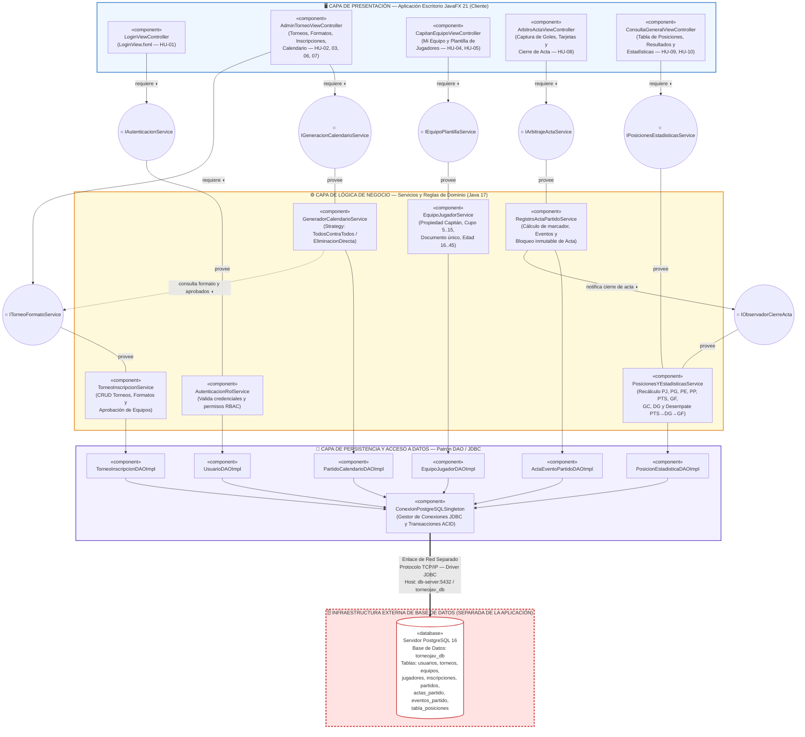

```mermaid
flowchart TB
    %% =========================================================
    %% 1. CAPA DE PRESENTACIÓN (COMPONENTES JAVAFX EXPLÍCITOS)
    %% =========================================================
    subgraph CapaPresentacion ["🖥️ CAPA DE PRESENTACIÓN — Aplicación Escritorio JavaFX 21 (Cliente)"]
        direction LR
        VistaLogin["«component»\nLoginViewController\n(LoginView.fxml — HU-01)"]
        VistaAdmin["«component»\nAdminTorneoViewController\n(Torneos, Formatos, Inscripciones,\nCalendario — HU-02, 03, 06, 07)"]
        VistaCapitan["«component»\nCapitanEquipoViewController\n(Mi Equipo y Plantilla de\nJugadores — HU-04, HU-05)"]
        VistaArbitro["«component»\nArbitroActaViewController\n(Captura de Goles, Tarjetas y\nCierre de Acta — HU-08)"]
        VistaConsultas["«component»\nConsultaGeneralViewController\n(Tabla de Posiciones, Resultados y\nEstadísticas — HU-09, HU-10)"]
    end

    %% =========================================================
    %% 2. INTERFACES DE SERVICIO (CONTRATOS PROVISTOS/REQUERIDOS)
    %% =========================================================
    IAuth(("○ IAutenticacionService"))
    ITorneo(("○ ITorneoFormatoService"))
    IEquipo(("○ IEquipoPlantillaService"))
    ICalendario(("○ IGeneracionCalendarioService"))
    IArbitraje(("○ IArbitrajeActaService"))
    IConsultas(("○ IPosicionesEstadisticasService"))

    %% =========================================================
    %% 3. CAPA DE LÓGICA DE NEGOCIO (SERVICIOS Y PATRONES)
    %% =========================================================
    subgraph CapaNegocio ["⚙️ CAPA DE LÓGICA DE NEGOCIO — Servicios y Reglas de Dominio (Java 17)"]
        direction TB
        CompAuth["«component»\nAutenticacionRolService\n(Valida credenciales y permisos RBAC)"]
        CompTorneo["«component»\nTorneoInscripcionService\n(CRUD Torneos, Formatos y\nAprobación de Equipos)"]
        CompEquipo["«component»\nEquipoJugadorService\n(Propiedad Capitán, Cupo 5..15,\nDocumento único, Edad 16..45)"]
        CompCalendario["«component»\nGeneradorCalendarioService\n(Strategy: TodosContraTodos /\nEliminacionDirecta)"]
        CompArbitraje["«component»\nRegistroActaPartidoService\n(Cálculo de marcador, Eventos y\nBloqueo inmutable de Acta)"]
        CompPosiciones["«component»\nPosicionesYEstadisticasService\n(Recálculo PJ, PG, PE, PP, PTS, GF,\nGC, DG y Desempate PTS→DG→GF)"]
    end

    %% Interfaz interna Observer entre Cierre de Acta y Tabla de Posiciones
    IObservador(("○ IObservadorCierreActa"))

    %% =========================================================
    %% 4. CAPA DE ACCESO A DATOS (PATRÓN DAO + SINGLETON JDBC)
    %% =========================================================
    subgraph CapaAccesoDatos ["🔌 CAPA DE PERSISTENCIA Y ACCESO A DATOS — Patrón DAO / JDBC"]
        direction TB
        DAO_Usuario["«component»\nUsuarioDAOImpl"]
        DAO_Torneo["«component»\nTorneoInscripcionDAOImpl"]
        DAO_Equipo["«component»\nEquipoJugadorDAOImpl"]
        DAO_Partido["«component»\nPartidoCalendarioDAOImpl"]
        DAO_Acta["«component»\nActaEventoPartidoDAOImpl"]
        DAO_Posicion["«component»\nPosicionEstadisticaDAOImpl"]

        PoolJDBC["«component»\nConexionPostgreSQLSingleton\n(Gestor de Conexiones JDBC y Transacciones ACID)"]
    end

    %% =========================================================
    %% 5. NODO EXTERNO SEPARADO: MOTOR DE BASE DE DATOS
    %% =========================================================
    subgraph EntornoBaseDatosSeparado ["🗄️ INFRAESTRUCTURA EXTERNA DE BASE DE DATOS (SEPARADA DE LA APLICACIÓN)"]
        direction TB
        MotorPostgreSQL[("«database»\nServidor PostgreSQL 16\nBase de Datos: torneojav_db\nTablas: usuarios, torneos, equipos,\njugadores, inscripciones, partidos,\nactas_partido, eventos_partido,\ntabla_posiciones")]
    end

    %% Relaciones Presentación -> Interfaces -> Negocio
    VistaLogin -->|requiere ◖| IAuth ---|provee| CompAuth
    VistaAdmin -->|requiere ◖| ITorneo ---|provee| CompTorneo
    VistaAdmin -->|requiere ◖| ICalendario ---|provee| CompCalendario
    VistaCapitan -->|requiere ◖| IEquipo ---|provee| CompEquipo
    VistaArbitro -->|requiere ◖| IArbitraje ---|provee| CompArbitraje
    VistaConsultas -->|requiere ◖| IConsultas ---|provee| CompPosiciones

    %% Relaciones internas de Negocio
    CompCalendario -.->|consulta formato y aprobados ◖| ITorneo
    CompArbitraje -->|notifica cierre de acta ◖| IObservador ---|provee| CompPosiciones

    %% Relaciones Negocio -> DAOs
    CompAuth --> DAO_Usuario
    CompTorneo --> DAO_Torneo
    CompEquipo --> DAO_Equipo
    CompCalendario --> DAO_Partido
    CompArbitraje --> DAO_Acta
    CompPosiciones --> DAO_Posicion

    %% Relaciones DAOs -> Gestor JDBC
    DAO_Usuario --> PoolJDBC
    DAO_Torneo --> PoolJDBC
    DAO_Equipo --> PoolJDBC
    DAO_Partido --> PoolJDBC
    DAO_Acta --> PoolJDBC
    DAO_Posicion --> PoolJDBC

    %% Enlace de Red Explícito hacia la Base de Datos Separada
    PoolJDBC ===>|"Enlace de Red Separado\nProtocolo TCP/IP — Driver JDBC\nHost: db-server:5432 / torneojav_db"| MotorPostgreSQL

    style CapaPresentacion fill:#eef6ff,stroke:#1b6ec2,stroke-width:2px
    style CapaNegocio fill:#fff9db,stroke:#e67700,stroke-width:2px
    style CapaAccesoDatos fill:#f3f0ff,stroke:#5f3dc4,stroke-width:2px
    style EntornoBaseDatosSeparado fill:#ffe3e3,stroke:#c92a2a,stroke-width:3px,stroke-dasharray: 6 4
    style MotorPostgreSQL fill:#ffffff,stroke:#c92a2a,stroke-width:2px
```
