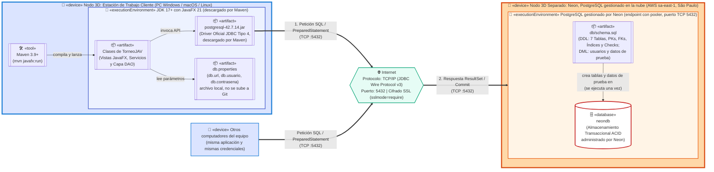

```mermaid
flowchart LR
    %% =========================================================================
    %% NODO FÍSICO 1: ESTACIÓN DE TRABAJO CLIENTE (CAJA 3D DE ESCRITORIO)
    %% =========================================================================
    subgraph NodoCliente3D ["🧊 «device» Nodo 3D: Estación de Trabajo Cliente (PC Windows / macOS / Linux)"]
        direction TB
        ArtMaven[["🛠️ «tool»<br/>Maven 3.9+<br/>(mvn javafx:run)"]]
        subgraph EntornoJVM3D ["🧊 «executionEnvironment» JDK 17+ con JavaFX 21 (descargado por Maven)"]
            direction TB
            ArtEjecutable[["📦 «artifact»<br/>Clases de TorneoJAV<br/>(Vistas JavaFX, Servicios<br/>y Capa DAO)"]]
            ArtDriverJDBC[["📦 «artifact»<br/>postgresql-42.7.14.jar<br/>(Driver Oficial JDBC Tipo 4,<br/>descargado por Maven)"]]
            ArtConfiguracion[["📦 «artifact»<br/>db.properties<br/>(db.url, db.usuario, db.contrasena)<br/>archivo local, no se sube a Git"]]
        end
    end

    %% Otros usuarios del equipo, con la misma aplicación y las mismas credenciales
    OtrosClientes["🧊 «device» Otros computadores del equipo<br/>(misma aplicación y mismas credenciales)"]

    %% =========================================================================
    %% CANAL DE RED ENTRE LOS NODOS
    %% =========================================================================
    CanalRed{{"🌐 Internet<br/>Protocolo: TCP/IP (JDBC Wire Protocol v3)<br/>Puerto: 5432 | Cifrado SSL (sslmode=require)"}}

    %% =========================================================================
    %% NODO FÍSICO 2: BASE DE DATOS GESTIONADA EN LA NUBE (NEON)
    %% =========================================================================
    subgraph NodoServidorBD3D ["🧊 «device» Nodo 3D Separado: Neon, PostgreSQL gestionado en la nube (AWS sa-east-1, São Paulo)"]
        direction TB
        subgraph EntornoPostgres3D ["🧊 «executionEnvironment» PostgreSQL gestionado por Neon (endpoint con pooler, puerto TCP 5432)"]
            direction TB
            ArtSchemaDDL[["📦 «artifact»<br/>db/schema.sql<br/>(DDL: 7 Tablas, PKs, FKs, Índices y Checks;<br/>DML: usuarios y datos de prueba)"]]
            VolumenDatos[("🗄️ «database»<br/>neondb<br/>(Almacenamiento Transaccional ACID<br/>administrado por Neon)")]
        end
    end

    %% Relaciones internas y de red
    ArtMaven -->|compila y lanza| ArtEjecutable
    ArtEjecutable -->|lee parámetros| ArtConfiguracion
    ArtEjecutable -->|invoca API| ArtDriverJDBC
    ArtDriverJDBC ===>|"1. Petición SQL / PreparedStatement<br/>(TCP :5432)"| CanalRed
    OtrosClientes ===>|"Petición SQL / PreparedStatement<br/>(TCP :5432)"| CanalRed
    CanalRed ===>|"2. Respuesta ResultSet / Commit<br/>(TCP :5432)"| EntornoPostgres3D
    ArtSchemaDDL -->|"crea tablas y datos de prueba en<br/>(se ejecuta una vez)"| VolumenDatos

    %% Estilos de Cajas con Borde Volumétrico 3D
    style NodoCliente3D fill:#dbe4ff,stroke:#1c7ed6,stroke-width:4px
    style EntornoJVM3D fill:#edf2ff,stroke:#364fc7,stroke-width:2px
    style OtrosClientes fill:#dbe4ff,stroke:#1c7ed6,stroke-width:2px
    style NodoServidorBD3D fill:#ffd8a8,stroke:#d9480f,stroke-width:4px
    style EntornoPostgres3D fill:#fff4e6,stroke:#e8590c,stroke-width:2px
    style VolumenDatos fill:#ffffff,stroke:#c92a2a,stroke-width:3px
    style CanalRed fill:#e6fcf5,stroke:#0ca678,stroke-width:2px
```
