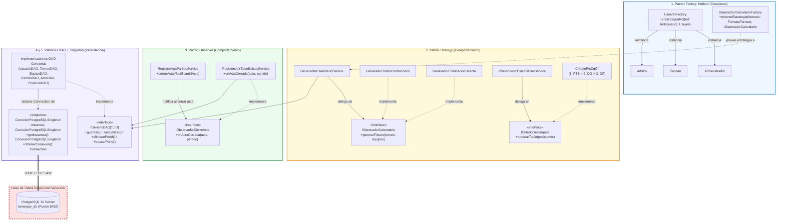

```mermaid
flowchart TB
    %% =========================================================
    %% PATRON 1: FACTORY METHOD (CREACION POLIMORFICA)
    %% =========================================================
    subgraph PatronFactory ["1. Patron Factory Method (Creacional)"]
        direction TB
        F_User["UsuarioFactory<br/>+crearSegunRol(rol: RolUsuario): Usuario"]
        F_Cal["GeneradorCalendarioFactory<br/>+obtenerEstrategia(formato: FormatoTorneo): IGeneradorCalendario"]
        Sub_Admin["Administrador"]
        Sub_Cap["Capitan"]
        Sub_Arb["Arbitro"]

        F_User -->|instancia| Sub_Admin
        F_User -->|instancia| Sub_Cap
        F_User -->|instancia| Sub_Arb
    end

    %% =========================================================
    %% PATRON 2: STRATEGY (ALGORITMOS INTERCAMBIABLES HU-03, 07, 09)
    %% =========================================================
    subgraph PatronStrategy ["2. Patron Strategy (Comportamiento)"]
        direction TB
        Ctx_Cal["GeneradorCalendarioService"]
        Int_Cal["«interface»<br/>IGeneradorCalendario<br/>+generarFixture(torneo, equipos)"]
        Str_Todos["GeneradorTodosContraTodos"]
        Str_Elim["GeneradorEliminacionDirecta"]

        Ctx_Pos["PosicionesYEstadisticasService"]
        Int_Des["«interface»<br/>ICriterioDesempate<br/>+ordenarTabla(posiciones)"]
        Str_Pts["CriterioPtsDgGf<br/>(1. PTS > 2. DG > 3. GF)"]

        Ctx_Cal -->|delega en| Int_Cal
        Str_Todos -.->|implementa| Int_Cal
        Str_Elim -.->|implementa| Int_Cal

        Ctx_Pos -->|delega en| Int_Des
        Str_Pts -.->|implementa| Int_Des
    end

    %% =========================================================
    %% PATRON 3: OBSERVER (EVENTO DE CIERRE DE ACTA HU-08 -> HU-09)
    %% =========================================================
    subgraph PatronObserver ["3. Patron Observer (Comportamiento)"]
        direction TB
        Pub_Acta["RegistroActaPartidoService<br/>+cerrarActaYNotificar(idActa)"]
        Int_Obs["«interface»<br/>IObservadorCierreActa<br/>+onActaCerrada(acta, partido)"]
        Sub_Pos["PosicionesYEstadisticasService<br/>+onActaCerrada(acta, partido)"]

        Pub_Acta -->|notifica al cerrar acta| Int_Obs
        Sub_Pos -.->|implementa| Int_Obs
    end

    %% =========================================================
    %% PATRON 4 Y 5: DAO + SINGLETON (PERSISTENCIA HACIA BD SEPARADA)
    %% =========================================================
    subgraph PatronDAOSingleton ["4 y 5. Patrones DAO + Singleton (Persistencia)"]
        direction TB
        Int_DAO["«interface»<br/>IGenericDAO[T, ID]<br/>+guardar() / +actualizar() / +eliminarPorId() / +buscarPorId()"]
        Impl_DAOs["Implementaciones DAO Concretas<br/>(UsuarioDAO, TorneoDAO, EquipoDAO,<br/>PartidoDAO, ActaDAO, PosicionDAO)"]
        Sing_JDBC["«singleton»<br/>ConexionPostgreSQLSingleton<br/>-instancia: ConexionPostgreSQLSingleton<br/>+getInstancia(): ConexionPostgreSQLSingleton<br/>+obtenerConexion(): Connection"]

        Impl_DAOs -.->|implementa| Int_DAO
        Impl_DAOs -->|obtiene Connection de| Sing_JDBC
    end

    %% =========================================================
    %% BASE DE DATOS SEPARADA
    %% =========================================================
    subgraph BaseDatosExterna ["Base de Datos Relacional Separada"]
        PG_Ext[("PostgreSQL 16 Server<br/>torneojav_db (Puerto 5432)")]
    end

    F_Cal -.->|provee estrategia a| Ctx_Cal
    Ctx_Cal --> Int_DAO
    Sub_Pos --> Int_DAO
    Sing_JDBC ===>|"JDBC / TCP :5432"| PG_Ext

    style PatronFactory fill:#eef6ff,stroke:#1b6ec2,stroke-width:2px
    style PatronStrategy fill:#fff9db,stroke:#e67700,stroke-width:2px
    style PatronObserver fill:#ebfbee,stroke:#2b8a3e,stroke-width:2px
    style PatronDAOSingleton fill:#f3f0ff,stroke:#5f3dc4,stroke-width:2px
    style BaseDatosExterna fill:#ffe3e3,stroke:#c92a2a,stroke-width:3px,stroke-dasharray: 5 5
```
