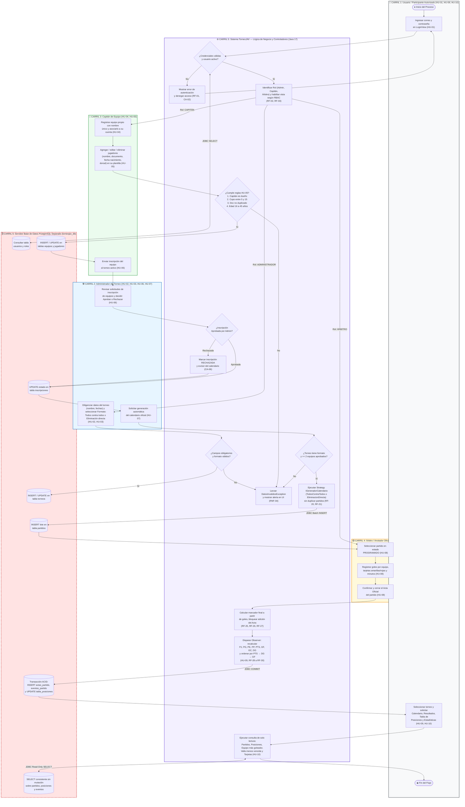

```mermaid
flowchart TB
    %% =========================================================================
    %% CARRIL 1: ACTOR USUARIO / PARTICIPANTE (LOGIN Y CONSULTAS HU-01, 09, 10)
    %% =========================================================================
    subgraph CarrilUsuario ["👤 CARRIL 1: Usuario / Participante Autorizado (HU-01, HU-09, HU-10)"]
        U_Inicio(["● Inicio del Proceso"])
        U_Login["Ingresar correo y contraseña\nen LoginView (HU-01)"]
        U_Consultar["Seleccionar torneo y solicitar\nCalendario, Resultados, Tabla de\nPosiciones y Estadísticas (HU-09, HU-10)"]
        U_Fin(["◉ Fin del Flujo"])
    end

    %% =========================================================================
    %% CARRIL 2: ACTOR ADMINISTRADOR (TORNEOS, FORMATOS, INSCRIPCIONES, CALENDARIO)
    %% =========================================================================
    subgraph CarrilAdmin ["🛠️ CARRIL 2: Administrador del Torneo (HU-02, HU-03, HU-06, HU-07)"]
        A_CrearTorneo["Diligenciar datos del torneo\n(nombre, fechas) y seleccionar Formato:\nTodos contra todos o Eliminación directa\n(HU-02, HU-03)"]
        A_RevisarInsc["Revisar solicitudes de inscripción\nde equipos y decidir: Aprobar o Rechazar\n(HU-06)"]
        A_SolicitarCal["Solicitar generación automática\ndel calendario oficial (HU-07)"]
    end

    %% =========================================================================
    %% CARRIL 3: ACTOR CAPITÁN DE EQUIPO (EQUIPO Y JUGADORES HU-04, HU-05)
    %% =========================================================================
    subgraph CarrilCapitan ["🧢 CARRIL 3: Capitán de Equipo (HU-04, HU-05)"]
        C_RegistrarEq["Registrar equipo propio con nombre\núnico y asociarlo a su cuenta (HU-04)"]
        C_GestionarJug["Agregar / editar / eliminar jugadores\n(nombre, documento, fecha nacimiento,\ndorsal) en su plantilla (HU-05)"]
        C_PostularEq["Enviar inscripción del equipo\nal torneo activo (HU-06)"]
    end

    %% =========================================================================
    %% CARRIL 4: ACTOR ÁRBITRO (RESULTADOS, EVENTOS Y ACTA HU-08)
    %% =========================================================================
    subgraph CarrilArbitro ["🟨 CARRIL 4: Árbitro / Anotador Oficial (HU-08)"]
        R_SeleccionarPart["Seleccionar partido en estado\nPROGRAMADO (HU-08)"]
        R_RegistrarEv["Registrar goles por equipo,\ntarjetas amarillas/rojas y minutos (HU-08)"]
        R_CerrarActa["Confirmar y cerrar el Acta Oficial\ndel partido (HU-08)"]
    end

    %% =========================================================================
    %% CARRIL 5: SISTEMA TORNEOJAV (LÓGICA DE NEGOCIO Y VALIDACIONES)
    %% =========================================================================
    subgraph CarrilSistema ["⚙️ CARRIL 5: Sistema TorneoJAV — Lógica de Negocio y Controladores (Java 17)"]
        S_ValLogin{"¿Credenciales válidas\ny usuario activo?"}
        S_ErrorLogin["Mostrar error de autenticación\ny denegar acceso (RF-01, CA-02)"]
        S_RedirigirRol["Identificar Rol (Admin, Capitán,\nÁrbitro) y habilitar vista según RBAC\n(RF-02, RF-03)"]

        S_ValTorneo{"¿Campos obligatorios\ny formato válidos?"}
        S_ValPlantilla{"¿Cumple reglas HU-05?\n1. Capitán es dueño\n2. Cupo entre 5 y 15\n3. Doc no duplicado\n4. Edad 16 a 45 años"}
        S_ErrorValidacion["Lanzar DatosInvalidosException\ny mostrar alerta en UI (RNF-04)"]

        S_EvalInscripcion{"¿Inscripción\nAprobada por Admin?"}
        S_DescartarEq["Marcar inscripción RECHAZADA\ny excluir del calendario (CA-06)"]

        S_ValPreCalendario{"¿Torneo tiene formato\ny >= 2 equipos aprobados?"}
        S_GenerarCruces["Ejecutar Strategy IGeneradorCalendario\n(TodosContraTodos o EliminacionDirecta)\nsin duplicar partidos (RF-20, RF-21)"]

        S_CalcularMarcador["Calcular marcador final a partir\nde goles, bloquear edición del Acta\n(RF-25, RF-26, RF-27)"]
        S_ActualizarTabla["Disparar Observer: recalcular\nPJ, PG, PE, PP, PTS, GF, GC, DG\ny ordenar por PTS → DG → GF\n(HU-09, RF-28 a RF-30)"]
        S_ConsolidarConsulta["Ejecutar consulta de solo lectura:\nPartidos, Posiciones, Equipo más goleador,\nValla menos vencida y Tarjetas (HU-10)"]
    end

    %% =========================================================================
    %% CARRIL 6: BASE DE DATOS POSTGRESQL SEPARADA (PERSISTENCIA ACID)
    %% =========================================================================
    subgraph CarrilBaseDatos ["🗄️ CARRIL 6: Servidor Base de Datos PostgreSQL Separado (torneojav_db)"]
        DB_Users[("Consultar tabla\nusuarios y roles")]
        DB_Torneos[("INSERT / UPDATE en\ntabla torneos")]
        DB_EquiposJug[("INSERT / UPDATE en\ntablas equipos y jugadores")]
        DB_Inscripciones[("UPDATE estado en\ntabla inscripciones")]
        DB_Partidos[("INSERT lote en\ntabla partidos")]
        DB_ActasPos[("Transacción ACID:\nINSERT actas_partido, eventos_partido\ny UPDATE tabla_posiciones")]
        DB_Lectura[("SELECT consistente sin mutación\nsobre partidos, posiciones y eventos")]
    end

    %% Flujo de Conexiones entre Carriles
    U_Inicio --> U_Login
    U_Login --> S_ValLogin
    S_ValLogin <-->|JDBC SELECT| DB_Users
    S_ValLogin -->|No| S_ErrorLogin --> U_Login
    S_ValLogin -->|Sí| S_RedirigirRol

    %% Ramas por Rol tras Autenticación
    S_RedirigirRol -->|Rol: ADMINISTRADOR| A_CrearTorneo
    S_RedirigirRol -->|Rol: CAPITÁN| C_RegistrarEq
    S_RedirigirRol -->|Rol: ÁRBITRO| R_SeleccionarPart

    %% Flujo Creación de Torneo (HU-02, HU-03)
    A_CrearTorneo --> S_ValTorneo
    S_ValTorneo -->|No| S_ErrorValidacion
    S_ValTorneo -->|Sí| DB_Torneos

    %% Flujo Capitán: Equipos y Jugadores (HU-04, HU-05)
    C_RegistrarEq --> C_GestionarJug
    C_GestionarJug --> S_ValPlantilla
    S_ValPlantilla -->|No| S_ErrorValidacion
    S_ValPlantilla -->|Sí| DB_EquiposJug
    DB_EquiposJug --> C_PostularEq

    %% Flujo Aprobación de Inscripción (HU-06)
    C_PostularEq --> A_RevisarInsc
    A_RevisarInsc --> S_EvalInscripcion
    S_EvalInscripcion -->|Rechazada| S_DescartarEq --> DB_Inscripciones
    S_EvalInscripcion -->|Aprobada| DB_Inscripciones

    %% Flujo Generación de Calendario (HU-07)
    DB_Inscripciones --> A_SolicitarCal
    A_SolicitarCal --> S_ValPreCalendario
    S_ValPreCalendario -->|No| S_ErrorValidacion
    S_ValPreCalendario -->|Sí| S_GenerarCruces
    S_GenerarCruces -->|JDBC Batch INSERT| DB_Partidos

    %% Flujo Arbitraje y Cierre de Acta (HU-08) + Posiciones (HU-09)
    DB_Partidos --> R_SeleccionarPart
    R_SeleccionarPart --> R_RegistrarEv --> R_CerrarActa
    R_CerrarActa --> S_CalcularMarcador --> S_ActualizarTabla
    S_ActualizarTabla -->|JDBC COMMIT| DB_ActasPos

    %% Flujo Consulta Integral (HU-10)
    DB_ActasPos --> U_Consultar
    U_Consultar --> S_ConsolidarConsulta
    S_ConsolidarConsulta <-->|JDBC Read-Only SELECT| DB_Lectura
    S_ConsolidarConsulta --> U_Fin

    style CarrilUsuario fill:#f8f9fa,stroke:#495057,stroke-width:2px
    style CarrilAdmin fill:#e7f5ff,stroke:#1971c2,stroke-width:2px
    style CarrilCapitan fill:#ebfbee,stroke:#2f9e44,stroke-width:2px
    style CarrilArbitro fill:#fff9db,stroke:#f08c00,stroke-width:2px
    style CarrilSistema fill:#f3f0ff,stroke:#6741d9,stroke-width:2px
    style CarrilBaseDatos fill:#ffe3e3,stroke:#c92a2a,stroke-width:3px,stroke-dasharray: 5 5
```
